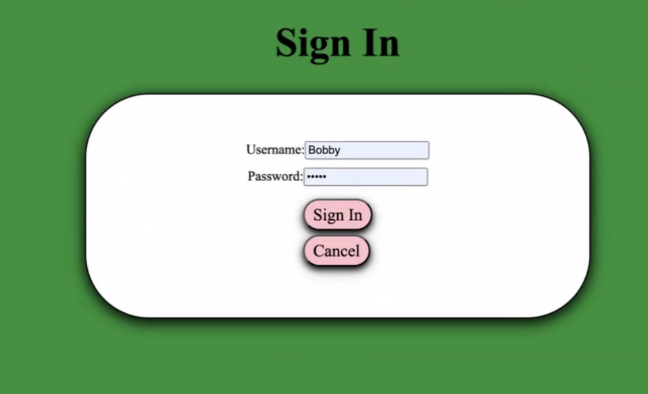
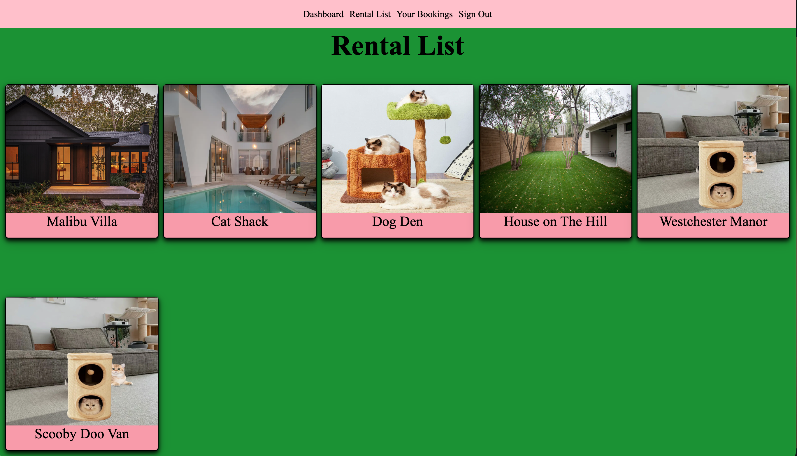
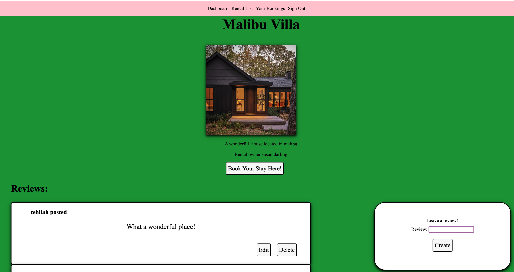
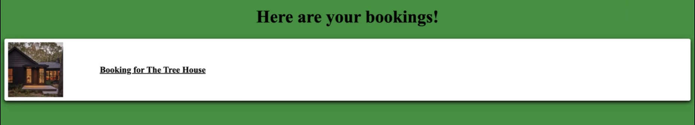
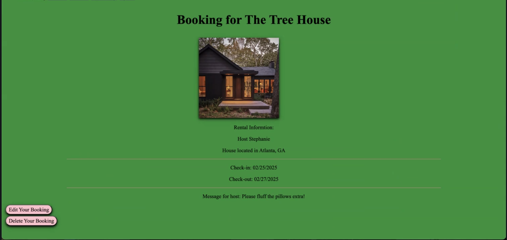

# Paw Pads

### The Team

#### Leah Irwin - Programmer, Deployment Manager

#### Zak Sandler - Programmer, GitHub Manager

#### Tehilah Zamanzadeh - Programmer, Project Manager

## Decription

Paw Pads is a property rental service that allows users to book stays at pet friendly places for vacations, parties, and more! Paw Pads offers a variety of rental types, and users can book stays, send personal messages or requests for their hosts, and review places they've stayed before! All pets welcome!

## Screenshots

|    Description    | Screenshot                                         |
| :---------------: | -------------------------------------------------- |
|    **Sign up**    |         |
|    **Rentals**    |     |
|  **Rental Page**  |  |
| **Your Bookings** |    |
|    **Booking**    |         |

## Technologies Used

## Using BookstaCart

  

  
 How Book A Rental 

    Navigate to the rentals page wherto browse a range of rental properties. Click a property to be directed to the information page of that rental. Click 'Book Your Stay' to make a reservation; input your check-in and hceck-out dates, and leave an optional message for your host. Once made you will be taken to your bookings page where you can click on, edit or delete a booking. 

  
 How to Purchase a Book

  On the information page of a rental property, you can view other user's review and leave a review your self. Just type in your review and click submit. 

  
 Trello Board 

  <a href="https://trello.com/b/QAmt9SFR/unit-3-project"
    >https://trello.com/b/QAmt9SFR/unit-3-project</a>

  
 Deployed Link 

  <a href="https://pawpads.netlify.app/"
    >https://pawpads.netlify.app/</a
  >

## Upcoming Features

- [ ] Users can login as renters and create rentalable properties
